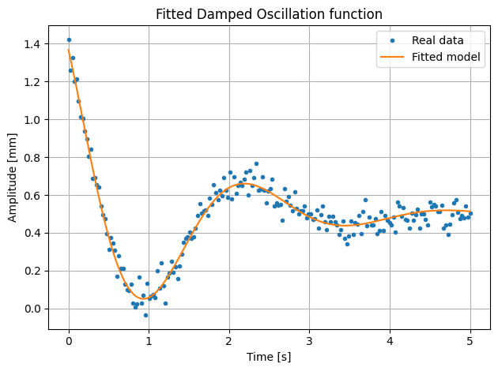

# Damped Oscillation Regression model

Code is available in the [damped-oscillation-regression.ipynb](damped-oscillation-regression.ipynb) notebook.

## Example

## Description

The model allows for finding the optimal parameters of the damped oscillation function that describe the underlying oscillatory pattern.

The model works by iteratively minimizing the mean squared error between predictions and observed data (using gradient descent) for a damped oscillation function defined as:

$$
y(x) = y_0 + A e^{-\lambda x} \cdot \cos(\omega x + \varphi)
$$

Where:

- $y_0$ - center of oscillations
- $A$ - initial amplitude
- $\lambda$ - damping rate
- $\omega$ - angular frequency
- $\varphi$ - phase shift

## Parameter stability through reparameterization

### Addressing gradient instability in the $\lambda$ parameter

The exponential term $e^{-\lambda x}$ creates a numerical problem during optimization. Small changes in $\lambda$ cause disproportionately large changes in the model output, leading to exploding gradients and unstable training.

To overcome this issue, a parameter transformation was implemented. Instead of directly optimizing $\lambda$, a parameter $\theta$ is optimized and $\lambda$ is derived using the softplus function:

$$
\lambda = \text{softplus}(\theta) = \ln(1 + e^{\theta})
$$

This reparameterization ensures $\lambda$ remains strictly positive and fixes the exploding gradient problem
